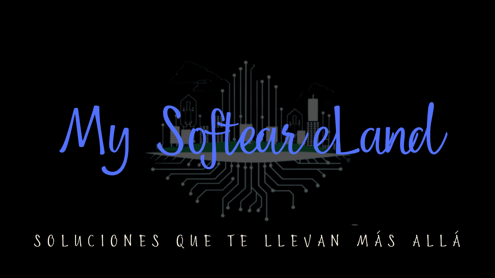

<h1 align="center">Hi there 👋, I'm Luis Manuel Castaño</h1>

  

  🚀 <strong>Desarrollador Full Stack Web y Móvil</strong> 🌐📱

  Bienvenido a mi repositorio de GitHub! Aquí encontrarás proyectos innovadores en desarrollo web y móvil, desde frontend hasta backend.

  <b>Tecnologías:</b>

<table align="center">
  <tr>
    <td align="center"><strong>Frontend</strong></td>
    <td align="center"><strong>Backend</strong></td>
  </tr>
  <tr>
    <td align="center">
      
      
      
      
      
      
      
      
    </td>
    <td align="center">
      
      
      
      
      
      
      
      
      
      
      
    </td>
  </tr>
</table>

  

## Proyectos Destacados

### Proyecto 1: Sistema de Gestión de Proyectos

Este proyecto es un Sistema de Gestión de Proyectos desarrollado con tecnologías Full Stack. Permite a los usuarios crear, asignar y dar seguimiento a tareas, así como gestionar recursos y plazos. Está construido utilizando Node.js, Express.js en el backend, y React.js en el frontend. Además, se integra con bases de datos SQL y NoSQL para almacenar y gestionar la información de manera eficiente.

---

### Proyecto 2: Aplicación Móvil de Noticias

Esta aplicación móvil de noticias ofrece a los usuarios una experiencia intuitiva para mantenerse actualizados con las últimas noticias. Desarrollada con Flutter, la aplicación proporciona una interfaz elegante y fluida, permitiendo a los usuarios personalizar sus preferencias y recibir notificaciones sobre temas de su interés. La integración con APIs de noticias garantiza la entrega de contenido fresco y relevante en tiempo real.

